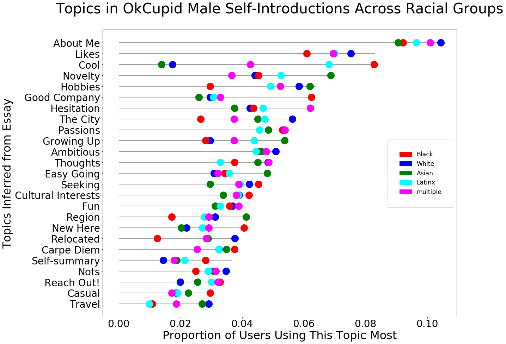
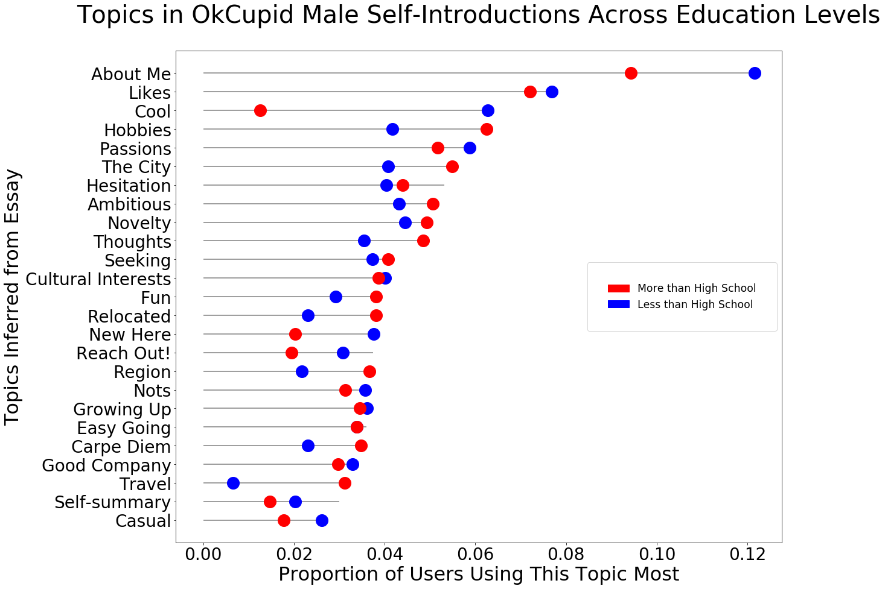
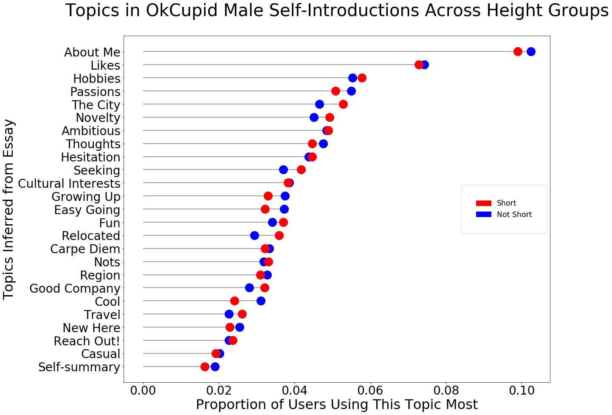
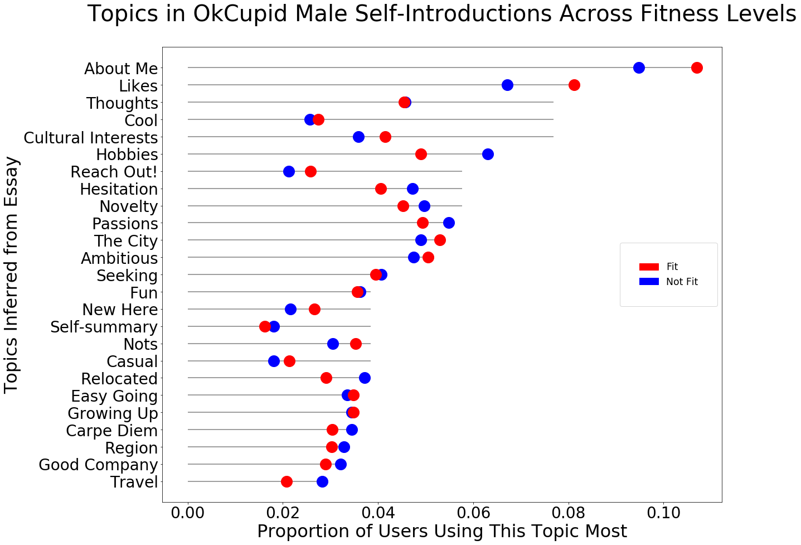
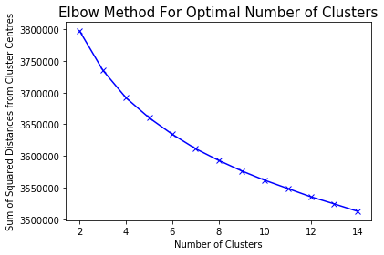
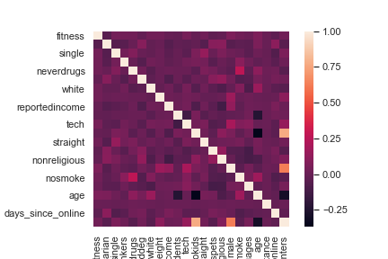
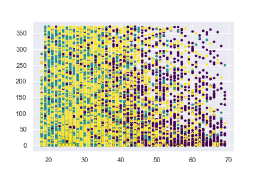
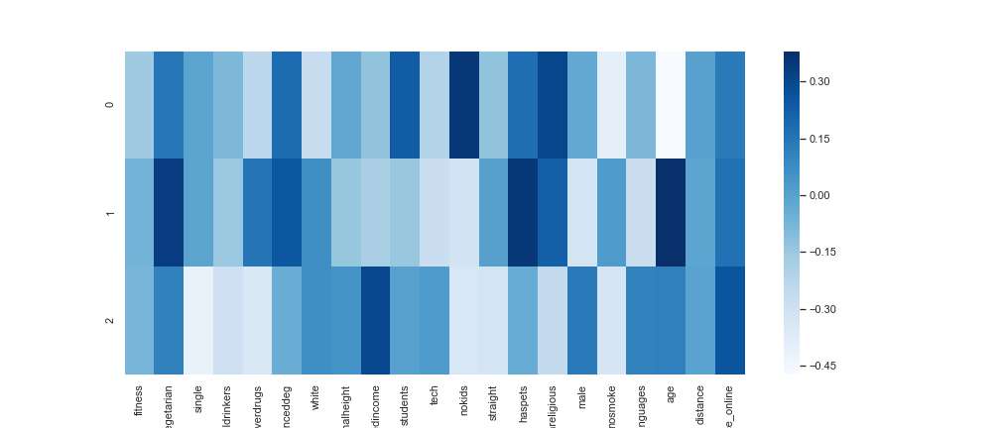

```{r setup, include=FALSE}
library(tidyverse)
library(here)
library(treemapify)
library(GGally)
library(skimr)
library(knitr)
library(kableExtra)

knitr::opts_chunk$set(echo = TRUE, warning=FALSE, fig.width=8, fig.height=6, dev = "png", dpi = 400, tidy.opts=list(width.cutoff=50), tidy=TRUE)

set.seed(60615)
if(Sys.info()[1] == "Windows") {
  windows.options(antialias = "cleartype")
  options(device = Cairo::CairoWin)
} else {
  options(device = Cairo::CairoPDF)
}

fix_nas = function(data_set, na_strs) {
  library(tidyverse)
  for (var in names(data_set)) {
    data_set[[var]][data_set[[var]] %in% na_strs] = NA
  }
  return(data_set)
}

collapse_to_other = function(variable, n_categories, ...) {
  library(tidyverse)
  if (length(unique(variable)) > n_categories) {
    var_table = variable %>% table() %>% as_tibble() %>% arrange(-n)
    other_cats = var_table$.[n_categories:length(var_table$.)]
    variable = variable %>% as.character()
    variable[variable %in% other_cats] = "Other"
    variable[str_to_lower(variable) == "other"] = "Other"
  }
  return(variable)
}

full_cleaned_data = readRDS(here("Data", "full_ok_cupid_cleaned.rds"))
```

## Exploratory Data Analysis

### Descriptive Statistics

Overall, this dataset encompasses `r ncol(full_cleaned_data)` variables for `r nrow(full_cleaned_data)` observations. Each observation is a dating profile for a person, gathered from subset of OkCupid users active on 2012/06/30, who had been active within the lst year and had at least one profile photo. Users were located within a 25 mile radius of San Francisco when the data was scraped. `r length(full_cleaned_data$visiting)` were "visiting" and listed a location outside of a 25 mile radius from San Francisco on their profile. Approximately `r round(sum(full_cleaned_data$sex == "m") / nrow(full_cleaned_data) * 100)`% of the profiles identfy as male, `r round(sum(na.omit(full_cleaned_data$ethnicity) == "white") / nrow(full_cleaned_data) * 100)`% as white, `r round(sum(full_cleaned_data$orientation == "straight") / nrow(full_cleaned_data) * 100)`% as straight, and `r round(sum(na.omit(full_cleaned_data$multi_ling)) / nrow(full_cleaned_data) * 100)`% as multilingual. The median age specified on profiles was `r median(full_cleaned_data$age)`.

```{r full-desc-stats, echo=FALSE, cache=TRUE}
full_data_descriptives = full_cleaned_data %>% select(-ends_with("raw")) %>% skim_to_list() 
full_data_descriptives[[1]] %>% select(-c(n))  %>% kable(caption = "Text Variables") %>% kable_styling(bootstrap_options = c("striped", "condensed", "responsive"))
full_data_descriptives[[2]] %>% select(-c(n))  %>% kable(caption = "Categorical Variables") %>% kable_styling(bootstrap_options = c("striped", "condensed", "responsive"))
full_data_descriptives[[4]] %>% select(-c(n)) %>% kable(caption = "Dummy Variables") %>% kable_styling(bootstrap_options = c("striped", "condensed", "responsive"))
full_data_descriptives[[5]] %>% select(-c(n, p25, p75, hist)) %>% kable(caption = "Continuous Variables") %>% kable_styling(bootstrap_options = c("striped", "condensed", "responsive"))
full_data_descriptives[[6]]  %>% select(-c(n)) %>% kable(caption = "Date-time Variables") %>% kable_styling(bootstrap_options = c("striped", "condensed", "responsive"))
```

### Visualizations

#### Continuous Variables
```{r full-num-viz, echo=FALSE, warning=FALSE, cache=TRUE}
full_cleaned_data %>% select_if(is.numeric) %>% select(-c(time_since_online, lon, lat)) %>% ggpairs(progress = FALSE) + theme(axis.text.x = element_text(angle = 20, hjust = 1))
```

#### Categorical Variables
```{r full-factors-viz, echo=FALSE, warning=FALSE, cache=TRUE}
is_categorical = function(x) {
  is.factor(x) | is.logical(x)
}

full_cleaned_data %>% select_if(is_categorical) %>% select(-ends_with("raw")) %>% mutate_all(factor) %>% pivot_longer(dplyr::everything()) %>% table() %>% as_tibble() %>% ggplot(aes(area = n, fill = value, label = value)) + geom_treemap() + geom_treemap_text(color = "white", place = "centre", grow = TRUE) + facet_wrap(~ name) + theme(legend.position = "none") + labs(title = "Categorical Variable Distributions")
```

```{r factors-sex, echo=FALSE, warning=FALSE, cache=TRUE}

full_cleaned_data %>% select_if(is_categorical) %>% select(-ends_with("raw")) %>% mutate_all(factor) %>% na.omit() %>% pivot_longer(-sex) %>% ggplot(aes(fill = sex, x = value)) + geom_bar(position = "fill") + scale_y_continuous(labels = scales::percent)  + scale_x_discrete(labels = abbreviate) + facet_wrap(~ name, scales = "free_x") + theme(axis.text.x = element_text(angle = 30, hjust = 1)) + labs(title = "Categorical Variable Distributions by Sex")
```

```{r factors-orient, echo=FALSE, warning=FALSE, cache=TRUE}

full_cleaned_data %>% select_if(is_categorical) %>% select(-ends_with("raw")) %>% mutate_all(factor) %>% na.omit() %>% pivot_longer(-orientation) %>% ggplot(aes(fill = orientation, x = value)) + geom_bar(position = "fill") + scale_y_continuous(labels = scales::percent)  + scale_x_discrete(labels = abbreviate) + facet_wrap(~ name, scales = "free_x") + theme(axis.text.x = element_text(angle = 30, hjust = 1)) + labs(title = "Categorical Variable Distributions by Sexual Orientation")
```

```{r factors-ethnic, echo=FALSE, warning=FALSE, cache=TRUE}
full_cleaned_data %>% select_if(is_categorical) %>% select(-ends_with("raw")) %>% mutate_all(factor) %>% mutate(ethnicity = collapse_to_other(ethnicity, 5))  %>% na.omit() %>% pivot_longer(-ethnicity) %>% ggplot(aes(fill = ethnicity, x = value)) + geom_bar(position = "fill") + scale_y_continuous(labels = scales::percent)  + scale_x_discrete(labels = abbreviate) + facet_wrap(~ name, scales = "free_x") + theme(axis.text.x = element_text(angle = 30, hjust = 1)) + labs(title = "Categorical Variable Distributions by Ethnicity")
```

Body types of "curvy" and "full figured" are used almost exclusively by women. Women were also overwhelmingly more likely to identify as bisexual or married than men. The majority of people who identified as gay or wanting more kids were men. Those who identify their body type as "jacked", those that dislike dogs or cats, or those who want more kids are less likely to be white. Those who identified as bisexual are more likely to be white than other sexual orientations. 

## Text Clustering

### Topic Modeling
We used the Non-Matrix Factorization method in Topic Analysis to build a topic model. We checked for differences in topics used by different models for different demographics- namely. The differences were not particularly notable. 

For race, we again see similar patterns. There are a few interesting patterns- such as the high use of words to do with ‘cool’ by African American men, and a relative lack thereof in Asian and White men. Black men also trail behind in their references to relocation and the region, and yet use words from the topics on being new. This may imply that they wish to emphasize being new and on the lookout for friends without mentioning where they are from, which might carry the burden of judgment. 
For height, there are almost no visible differences between the average representation of each topic



For education, we observe some differences in a few topics, such as ‘cool’ and ‘travel’ holding higher proportions for those with less and more than high school diplomas respectively. In other areas such as ‘Reach Out’ and ‘New Here’, we observe only a few percentage points’ difference



For height, we so no noteworthy differences beyond a few percentage points for ‘likes’ and ‘about me’. 



For fitness, similarly, no clear differences emerge.



Overall, there is close to little differentiation on any of these four variables of interest.

Future Extensions- We can check for similar difference on gender, religion, etc

### Vector Space Model Analysis of Profiles
We used SpaCy and other libraries to clean up the Self-Introduction essay in the profiles. We used the Doc2Vec technique- where each profile is assigned a single score based on the vector space model- averaging out across all the words in the model. We then collapse the vector space down to 2 dimensions using TSNE. We use elbow plots to check for clustering. Based on the plot, we see largely one elliptical ‘blob’. There does not seem to be a clear discernible pattern

```{r}
#
```



In the future, we could consider more agglomerative clustering methods for the profile scores.


## Demographic Clustering

The output quality from clustering depends heavily on the data we use. In the raw data, many variables are categorical. So we have to do some feature engineering with intuition from our experience using OkCupid.

1. Body type

The users could choose their body types as `average`, `fit`
, `athletic`, `thin`, `curvy`, `skinny`, `jacked`, etc. Since `average` and `fit` users are the most common (46% of the sample), we labeled them as 1 and the rest as 0. 

2. diet

We assume that people take diet preferences into consideration when choosing a future mate. Especially for people who are vegetarian, they might get along easier with partners who are vegetarians too. SO we labeled vegetarian users as 1 and the rest as 0. Surprisingly, this subset is almost half of the sample.

3. status

Generally, we would assume all people using online dating are single. However, there are 310 users who are married and 10 unknown. We classified all the `single` users as 1 and the rest as 0. 93% of them are single.

4. drinks

The drinks altitude is also important for choosing a partner as it might predict people's preferences for social events. We labeled `socially` as 1 the rest as 0. Although it is ambiguous of what `socially` means, we assume this is what most people would do (or pretend them to be) as 70% of them fall into this category.

5. drugs

It's highly impossible that people who don't do drugs would date someone likes drugs. So we labeled 1 for `never` drug users and 0 for the rest. 63% of them don't do drugs.

6. education

We define two groups of education level: the ones with/working on advanced degrees, and the ones who don't. Advanced degrees are Ph.D., masters, law school of medical school. 18% of the users are educated beyond the undergraduate level.

7. ethnicity

This is an important dimension when choosing the date. Many previous pieces of research also show that certain male or female races group are most/least popular on the online dating website. For simplicity, we just classified the `white` as 1 and the rest as 0. White users have the highest ratio of 55%, followed by Asian, Hispanic/Latin.

8. height

Height might not be a crucial factor. Here we labeled people as `normalheight` if their heights are in 25~75% percentile of the distribution, which means they are between 66 to 71 inches. Roughly half of the users have normal heights.

9. income

Not surprisingly, 81% of the people didn't specify their income level. So we labeled the 19% users who do as 1.

10. job

There are many job categories in the data. We are interested in two groups: the first one is students, as they certainly have a different dating preference than the other working professionals; the second one is people working in the tech and engineering industry. The two groups account for 8% and 16% of the total users, respectively.


11. Offspring


We labeled people who don't have kids as 1, which is 86% of the sample.

12. Orientation


We labeled people who are straight as 1, which is 86% of the sample.

13.  Pets

We labeled people who have pets as 1, which is 57% of the sample.


14. Religion


We labeled people who not religious at all as 1, which is 34% of the sample.


15. Sex


We labeled male users as 1, which is 60% of the sample.


16. Smokes


We labeled people who don't smoke as 1, which is 73% of the sample.


17. Speaks


We calculate the number of languages users indicate they know as a new feature.


18. Distance


We use Google Map API to calculate the physical distance between users' city to San Francisco.


19. Days since Online


This feature is calculated from the `last_online` variable in the raw data.


### Examine new features


The cleaned data has 59955 raws and 22 columns (features).


The heatmap shows there are no features pairs that are strongly correlated.





### Kmeans


We have started clustering with Kmeans. However, we haven't seen an optimal K by using the Elbow method and Silhouette Score. We need to further work on reducing the dimensions.


The following scatter plot illustrates the result by using 3 clusters. The y-axis is days since online. The x-axis is age. The color is their labeled clusters. We could see clusters 1 and 2 are on the left side, which represents mainly people younger than 45. Cluster 3 consists mainly of people who are older than 45.




### Principal Components Analysis

We start to use principal components to reduce the dimensions. We still need further work to decide the optimal number of components.

The following plot shows the first two principal components of models with 3 PC. The color represents being male or not.


The following heatmap shows the weights loadings of the 3 PCs.





